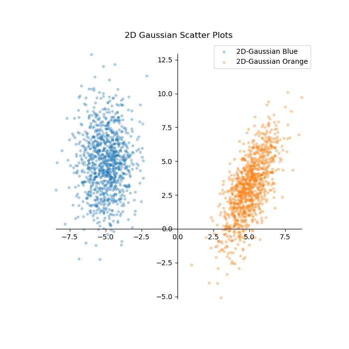
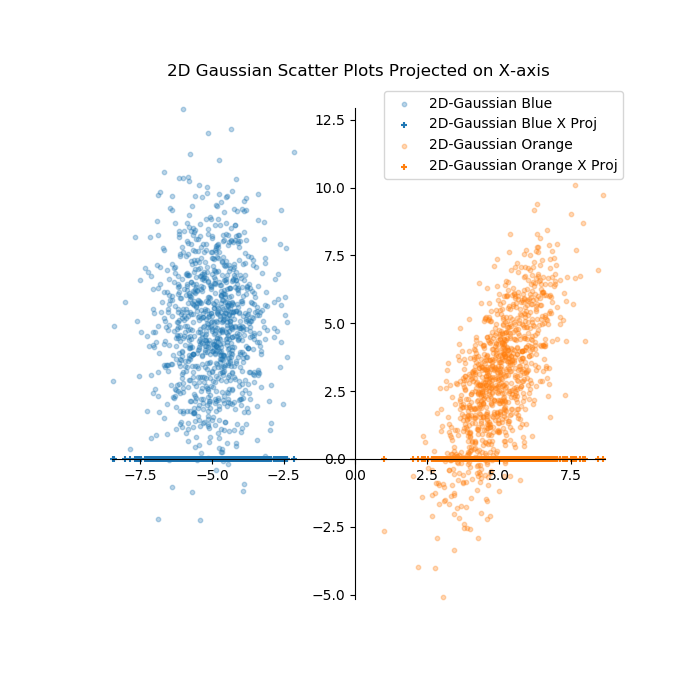
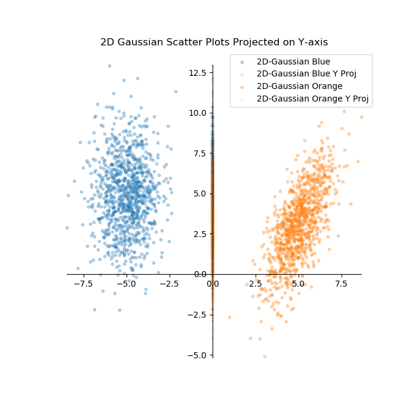
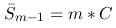

## Dimension Reduction

**Github Repository:** [GitHub Repository](https://github.com/drewc747/machine-learning-examples/tree/master/dimension_reduction)

**Techniques Explored:** Principle Componant Analysis (PCA), Linear Discriminant Analysis (LDA), Multi-Dimensional Scaling (MDS), Locality Sensitive Hashing (LSH)

**Skills Demonstrated:** Python, Dimension Reduction Techniques

**Project description:** In machine learning it is often desired to reduce the amount of dimensions (or features) of a given problem. As the number of dimensions in a problem increases, so does the problem complexity. However, it is often the case the features are redundant and can be removed with minimal decrease in a models performance while significantly decreasing the models complexity. This project will first explore a simple projection example, the curse of dimensionality, and then implement some common techniques used for dimension reduction as well as the advantages and disadvantages of each. Techniques to be explored are PCA, LDA, MDS, and LSH. 

### 1. What is feature reduction? A simple example:
As a simple example, let look at training data in a 2D space consisting of blue and orange circles. The data is generated by creating seperate 2-D gaussian scatter plots. First, let's create some 2D gaussian scatter plots:

```python
import numpy as np
import matplotlib.pyplot.plt

def generate_gaussian_scatter(mean, cov, num_samp):
    '''
    Method to generate a gaussian scatter
        mean: List of x and y values for mean
        cov: List of lists representing the covariance matrix, 2x2 matrix
        num_samp: Number of samples
    '''
    np.random.seed(1024)
    gaussian_scatter = np.random.multivariate_normal(mean, cov, num_samp)
    return gaussian_scatter
```

The function above simply takes a mean, covariance, and number of samples and uses the numpy library to return an array of points in the Gaussian. Next, we will write the code to plot the scatter points

```python
def plot_scatters(scatter_list, scatter_names):
    '''
    Method to plot a multiple scatter plots from a list
        scatter_list: List of lists, each list should contain scatter data (x, y)
        scatter_names: List of names for each scatter list to be plotted
    '''
    fig, ax = plt.subplots(figsize=(7, 7))
    for s in range(len(scatter_list)):
        ax.scatter(scatter_list[s][:,0], scatter_list[s][:,1], s=10.0, alpha=0.3, label=scatter_names[s])
    
    # Create x and y axis lines    
    ax.spines['left'].set_position('zero')
    ax.spines['right'].set_color('none')
    ax.spines['bottom'].set_position('zero')
    ax.spines['top'].set_color('none')
    ax.spines['left'].set_smart_bounds(True)
    ax.spines['bottom'].set_smart_bounds(True)
    
    ax.legend(loc=0)
    plt.show()
```

The method above takes a list of scatter arrays and a list of scatter names and plots them on a single figure. Finally, we can can call functions to put it all together and create some images.

```
def projection_example():
    scatter_list = []
    scatter_list.append(generate_gaussian_scatter(mean = [-5,5], cov = [[1, 1.5], [1.5, 5]], num_samp = 1000))
    scatter_list.append(generate_gaussian_scatter(mean = [5,3], cov = [[1, 1.5], [1.5, 5]], num_samp = 1000))
    
    scatter_names = ["2D-Gaussian Blue", "2D-Gaussian Set Orange"]
    
    plot_scatters(scatter_list, scatter_names)
    
def main():
    projection_example()

if __name__ == '__main__':
    main()
}
```

Here we create two 2-D gaussian scatter plots and then feed them into the "plot_scatters()" definition which provides the plot below:



Based on this training data, we may want to create a classifier that can tell us whether a data point blue or orange based on the xy coordinates, and in the case above there is a clear correlation with xy coordinates and color. We could draw a line between to seperate the training data, and then use that line for the test data to make a prediction on whether or not a data point is blue or orange based on where the datapoint falls relative to the line. Without getting into advanced techniques, we may just naiively choose any arbitrary line that seperates the two classes like shown in the plot below.


Using this line we can now predict what color future data points are based on their x,y corridinates. If the point falls to the left of the line, we may predict it to be blue, otherwise we would predict it to be orange.

Upon closer inspection, you can see that if you were to project all the data onto the x-axis, there is still seperation between the data points suggesting the the only feature that is needed to classify this data set is the x-coordinate. The plot below shows the data points projected onto the x axis and a point on the x-axis used as a threshold for classification.



Alternatively, if we try projecting the data onto the y-axis, we no longer have the ability to distinguish the red circles and blue square based on just the y value.  The plot below shows the data projected onto the y-axis.



This simple example shows that feature reduction can be performed in order to simplify a problem by removing redundant features. In this case, the y-value is redundant and unecessary for the classification of red circles and blue squares.


### 2. Why is feature reduction important? The curse of dimensionality:

The simple example above shows what feature reduction is, but typically a 2D problem isn't a problem we would need to perform feature reduction. However, most machine learning problems deal with high dimensions, which is hard to visualize and isn't as simple as plotting the data and picking a line to seperate the classes. In this section, we'll explore the curse of dimensionality and show why feature reduction is so important for higher dimensional problems.

The curse of dimensionality refers to various phenomona that occurs when increasing dimensions. One such phenomona is that as dimensions increase, dimension space increases exponentially. This can be imagined in the projection example above. The data can be represented on the x-axis with a dimensional space of 15 (from -7.5 to 7.5), but when the y-axis is taken into account it is represented in the x range by 15 and the y range by 17.5 (-5 to 12.5), giving a total dimensional space of 15*17.5 = 262.5. So by removing the redundant y value, we reduce the dimensional space from 262.5 to 15. In general, as the amount of features increases, the requried dimensional space increases exponentially.

Another phenomona is sparsity, since dimensional space increases exponentially, but the number of samples remains a constant, the area between samples increases exponentially as well which can make it more difficult to group data and efficiently generalize. As the features continue to increase without increasing the amount of training samples, there is a higher opporunity to overfit. In order to explore this problem in more detail, we will use the Gaussian distribution in high dimensional space. A spherical Gaussian in *m* dimensions can be explained by the following equation:

&ensp;&ensp;&ensp;

We define an *m*-dimensional sphere as a set of points in *m*-dimensional space that a distance *r* from the origin.

&ensp;&ensp;&ensp;

Where *S*<sub>*m-1*</sub>*(r)* represents the surface area of the *m*-dimensional sphere. The integral of the surface area gives us the volume of the sphere, or alternatively, the surface area can be expressed as the derivative of the volume:

&ensp;&ensp;&ensp;

Given that the volume of an *m*-dimensional circle is represented by:

&ensp;&ensp;&ensp;

Where *C* is some constant, and *r* is the radius of the sphere, we can then perform the derivative to get *S*<sub>*m-1*</sub>*(r)*:

&ensp;&ensp;&ensp;

If we look at a unit sphere (*r* = 1), the surface area of a unit circle simplifies to:

&ensp;&ensp;&ensp;

Substituting this in for our equation of the surface area of any *m*-dimensional sphere yields:

&ensp;&ensp;&ensp;

We can then calculate the density of the sampled points using the above equations. For any *x* lying on the sphere with radius *r*, the probability density is the same as ||*x*||<sub>2</sub> = *r*. Therefore we can directly multiply the probability density of every point by the surface area and get:

&ensp;&ensp;&ensp;

We can then calculate the radius at which the density has a single maximum value, *r_hat* for large *m* by taking the gradient with respect to *r* to be zero and solve for *r_hat*.

&ensp;&ensp;&ensp;

&ensp;&ensp;&ensp;

&ensp;&ensp;&ensp;

For large *m*, we now consider a small value *epsilon* << *r_hat* and consider to the density ratio of *r_hat + epsilon* over *r_hat*:

&ensp;&ensp;&ensp;

&ensp;&ensp;&ensp;

&ensp;&ensp;&ensp;

Using Taylor expansion for the log function, we get the following approximation:

&ensp;&ensp;&ensp;

&ensp;&ensp;&ensp;

And finally we are left with the approximated density ratio for large *m*:

&ensp;&ensp;&ensp;

Putting this all together we see that for a high dimensional gaussian, the greatest density of samples will reside near *r_hat* = *sqrt(m-1) * sigma*, and as you move away from that radius by some distance *epsilon*, the density will decrease exponentially as *exp*(-*epsilon*<sup>*2*</sup>/*sigma*<sup>*2*</sup>). However, in low dimensions, for example 2D and 3D, we see the majority of the samples reside near the origin within *sigma*.

We can write a quick python script that samples from an m-dimensional Gaussian to show this. In the script below we produce 100 samples and compute the mean and standard deviation of the radius of the samples for each value *m* from 1 to 500.

```python
num_samples = 100
dim = range(1, 500)

r_mean = []
r_sigma = []

for d in dim:
    # Generate m-dimensional gaussian points and calculate radius and sigma
    normal_deviates = np.random.normal(size=(d, num_samples))
    radius = np.sqrt((normal_deviates**2).sum(axis=0))
    sigma = np.std(radius)
    
    r_mean.append(np.mean(radius))
    r_sigma.append(sigma)

fig, ax = plt.subplots(figsize=(7, 7))
ax.plot(dim, r_mean)
ax.set(xlabel='Dimensions', ylabel='Radius mean', title='Radius vs dimensions - 100 samples')
plt.show

fig, ax = plt.subplots(figsize=(7, 7))
ax.plot(dim,r_sigma)
ax.set(xlabel='Dimensions', ylabel='Sigma', title='Sigma vs. dimensions - 100 samples')
plt.show()
```


The plots above agree with the formulas we derived, as *m* is increased, the average radius in creases as the *sqrt(m) * sigma*. Since *sigma* doesn't increase, the majority of the points stay near the radius and the majority of the points live only on the "shell" of the *m*-dimensional sphere as opposed to the entire volume.

### 3. Principle Componant Analysis (PCA)

Going back to our simple example of two 2D gaussians, the example lent itself well to a simple projection along the x or y axis. This was a case of feature reduction, we were able to simply remove a redundant feature. However, another method that can be used to reduce dimensionality is feature extraction. This is done by creating a new feature subspace from the existing features that retains the most relevant information while have fewer dimensions. Thinking back to our original simple example, you can imagine that if you were to draw a new axis to be projected on, you could optimize the class seperation while still performing a projection which would lend to a 1D dataset with more relavent data.

One method to achieve this is called principle componant analysis (PCA). In this section we will code PCA from scratch and then apply PCA to our original example before going through a couple other simple examples showcasing some of the advantages and disadvantages of PCA. We re-use the code to generate Gaussian scatter points and plot scatter plots, and we add the code below to perfrom PCA. For the purpose of this tutorial we will focus on reducing a 2d dataset into a 1d dataset for visualization purposes, but later we will adapt this code to work for any dimensional dataset with the ability to choose how many dimesnsions to reduce it to.

```python
def normalize(X):
    mean = np.mean(X, axis=0)
    return X - mean

def get_eigs(X):
    cov = np.cov(X.T)
    _, eig_val, eig_vec = np.linalg.svd(cov)
    return eig_val, eig_vec

def pca_2d_to_1d(scatter_list, scatter_names, num_samples):
    #plot original data
    plot_scatters(scatter_list, scatter_names)
    
    # Normalize data and get principle components
    center = normalize(np.concatenate(scatter_list))
    eig_val, eig_vec = get_eigs(center)
    print(eig_val)
    print(eig_vec)
    pc = eig_vec.T
    
    # Plot normalized data with eigenvectors
    norm = np.split(center, len(scatter_list))
    norm_names = ["Normalized " + s for s in scatter_names] 
    plot_scatters(norm, norm_names, pca = True, pc = pc, title = "Normalized Data with PCA axes")

    # Project rotated data in original space
    x_rot = np.dot(center, pc.T)
    proj = np.zeros(x_rot.shape)
    proj[:,0] = x_rot[:,0]
    proj = np.dot(np.linalg.inv(pc), proj.T).T
    
    # Plot normalized data with projected data to 1st eigenvector
    proj_list = np.split(proj, len(scatter_list))
    proj_names = [s + " PCA Projection onto 1st Eigenvector" for s in norm_names]
    plot_scatters(scatter_list + proj_list, norm_names + proj_names, title = "Normalized Data and Data projected onto 1st Eigenvector", proj_pca = True)
    
    #plot histogram
    proj_points = np.split(x_rot[:,0], len(scatter_list))
    hist_names = ["PCA Projections on 1st Eigenvector " + s for s in scatter_names]
    fig, ax = plt.subplots(figsize=(7, 7))
    ax.set(xlabel='X* - Projected Axis', ylabel='Count', title='Histogram of data points on projected axis')
    ax.hist(proj_points, bins=50, label = hist_names)
    ax.legend(loc=0)
    plt.show()
```
Looking closely as the code the majority of of the code is for plotting purposes. The PCA component consists of centering the data, calculating the eigenvector, then using the eigenvector to get your principle component(s).  Once you have your principle components, all that is left is simple transformations from the original space to the new subspace.

Applying PCA to the original simple example yields the following:


The image above shows the first and second eigenvectors, slightly shifted off the x and the y axes. We can then project the data onto the 1st axis to create a new feature along the new axis the compresses the data into a 1-D dataset. This is shown below:


An alternative way to view the data is to plot it as a histogram for each individual class to see the seperation. The plot below shows this and it can be seen that you could use a threshold of ~2 to predict the class of feature data using this extracted feature.


Looking at a more interesting example, we can generate three classes that can't easily be seperable on the x or y axis. The plot below shows the data as well as the first and second eigenvectors. In this case we can't simply project to the x or y axis or else we would lose the ability to distinguish the blue class from the green or the orange.


Projecting the data onto the first eigenvector keeps the ability to distinguish between the three classes while compressing the 2-D data into 1-D dataset.


The histograme below confirms what can be seen from the projected data that the is seperation between each class and you could create a threshold to make future predicitons.


Despite the above examples showing good success, a major drawback of PCA is that all it really does is take all the data in the original *m*-dimensional space and and calculate the eigenvalues, and then the order of your principle components are in descending order of the eigenvalues with the axis being the corresponding eignvector. In other terms, the axis with the largest variance is considered the axis with the most information and therefore your first componant. In many cases this can be true, especially for a single class of data as the axis with the largest variance will give a feature with the most ability to express itself. However, there are many cases, especially those with multiple classes that may have bad results, we explore one such example below:


We can see from looking at this data that the orange and blue classes are seperate. As mentioned earlier, PCA simply looks for the highest variance among all the data, and it is easy to see with this data that the first eigenvector achieves this. The image below shows the data projected on the first eigenvector as we did with the previous examples.


By just take the first eigenvector and projecting the data to it, we lose the relevant information and are no longer able to distinguish between the classes. This is further illustrated in the histogram below:


### 4. Linear Discriminant Analysis (LDA)


### 5. Multi-Dimensional Scaling (MDS)


### 6. Locality Sensitive Hashing (LSH)

