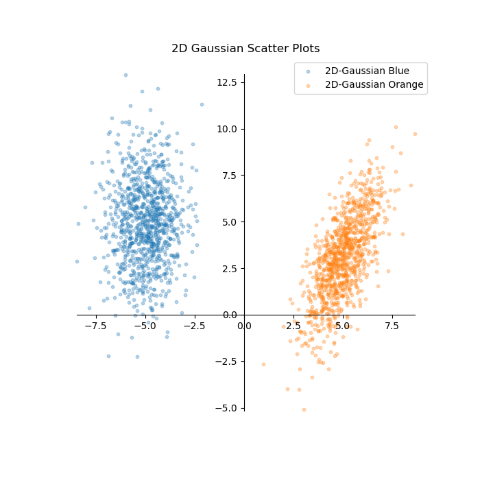
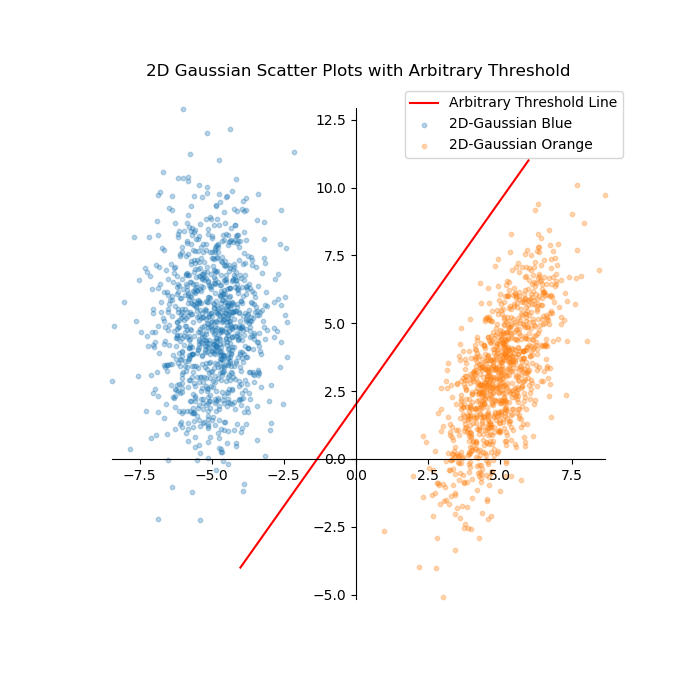
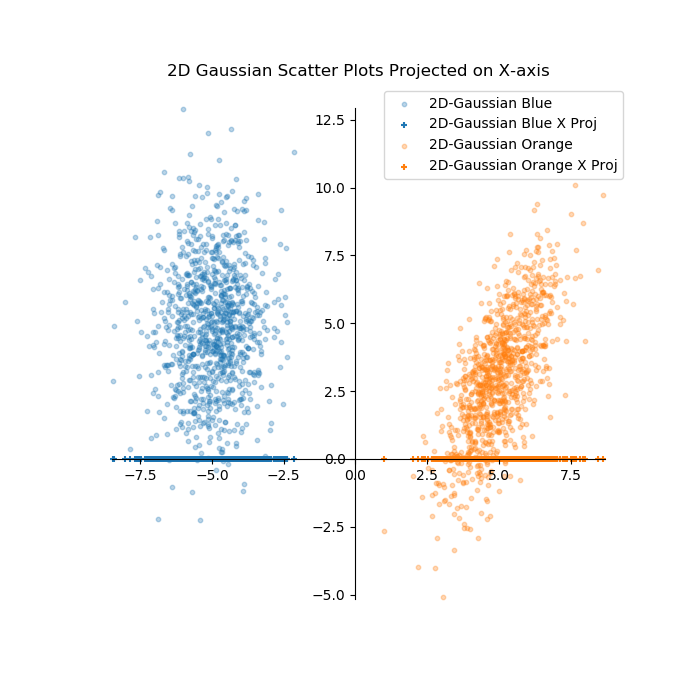
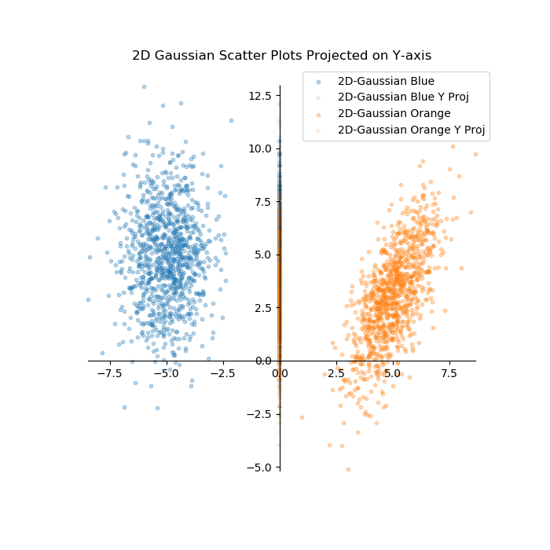

## Feature Reduction

**Techniques Explored:** Principle Componant Analysis (PCA), Linear Discriminant Analysis (LDA), Multi-Dimensional Scaling (MDS), Locality Sensitive Hashing (LSH)

**Skills Demonstrated:** Python, Feature Reduction Techniques

**Project description:** In machine learning it is often desired to reduce the amount of features (or dimensions) of a given problem. As the number of features in a problem increases, so does the problem complexity. However, it is often the case the features are redundant and can be removed with minimal decrease in a models performance while significantly decreasing the models complexity. This project will first explore the curse of dimensionality, a simple projection example, and then implament some common techniques used for feature reduction as well as the advantages and disadvantages of each. Techniques to be explored are PCA, LDA, MDS, and LSH. 

### 1. What is feature reduction? A simple example:
As a simple example, let look at training data in a 2D space consisting of blue circles and orange circles. The data is generated by creating seperate 2-D gaussian scatter plots. The code to create the data and plot of the data is shown below:

```python
import numpy as np
import matplotlib.pyplot.plt

def plot_scatters(scatter_list, scatter_names):
    '''
    Method to plot a multiple scatter plots from a list
        scatter_list: List of lists, each list should contain scatter data (x, y)
        scatter_names: List of names for each scatter list to be plotted
    '''
    fig, ax = plt.subplots(figsize=(7, 7))
    for s in range(len(scatter_list)):
        ax.scatter(scatter_list[s][:,0], scatter_list[s][:,1], s=10.0, alpha=0.3, label=scatter_names[s])
    
    # Create x and y axis lines    
    ax.spines['left'].set_position('zero')
    ax.spines['right'].set_color('none')
    ax.spines['bottom'].set_position('zero')
    ax.spines['top'].set_color('none')
    ax.spines['left'].set_smart_bounds(True)
    ax.spines['bottom'].set_smart_bounds(True)
    
    ax.legend(loc=0)
    plt.show()
    
def generate_gaussian_scatter(mean, cov, num_samp):
    '''
    Method to generate a gaussian scatter
        mean: List of x and y values for mean
        cov: List of lists representing the covariance matrix, 2x2 matrix
        num_samp: Number of samples
    '''
    np.random.seed(1024)
    gaussian_scatter = np.random.multivariate_normal(mean, cov, num_samp)
    return gaussian_scatter

def projection_example():
    scatter_list = []
    scatter_list.append(generate_gaussian_scatter(mean = [-5,5], cov = [[1, 1.5], [1.5, 5]], num_samp = 1000))
    scatter_list.append(generate_gaussian_scatter(mean = [5,3], cov = [[1, 1.5], [1.5, 5]], num_samp = 1000))
    
    scatter_names = ["2D-Gaussian Blue", "2D-Gaussian Set Orange"]
    
    plot_scatters(scatter_list, scatter_names)
    
def main():
    projection_example()

if __name__ == '__main__':
    main()
}
```

The code is a bit overkill for this example but is meant to be scalable for more complex examples and will serve as the base code for the rest of this tutorial. For this simple example we will be working off of the "projection_example" method. Here we create two 2-D gaussian scatter plots. The data is created using the "generate_gaussian_scatter()" method which takes a mean, covariance matrix, and number of samples and uses the numpy package to create a random list of data using the Gaussian. These lists are then fed into the "plot_scatters()" definition which provides the plot below:



Based on this training data, we may want to create a classifier that can tell us whether a data point blue or orange based on the xy coordinates, and in the case above there is a clear correlation with xy coordinates and color. We could draw a line between to seperate the training data, and then use that line for the test data to make a prediction on whether or not a data point is blue or orange based on where the datapoint falls relative to the line. Without getting into advanced techniques, we may just naiively choose any arbitrary line that seperates the two classes like shown in the plot below.



Using this line we can now predict what color future data points are based on their x,y corridinates. If the point falls to the left of the line, we may predict it to be blue, otherwise we would predict it to be orange.

Upon closer inspection, you can see that if you were to project all the data onto the x-axis, there is still seperation between the data points suggesting the the only feature that is needed to classify this data set is the x-coordinate. The plot below shows the data points projected onto the x axis and a point on the x-axis used as a threshold for classification.



Alternatively, if we try projecting the data onto the y-axis, we no longer have the ability to distinguish the red circles and blue square based on just the y value.  The plot below shows the data projected onto the y-axis.



This simple example shows that feature reduction can be performed in order to simplify a problem by removing redundant features. In this case, the y-value is redundant and unecessary for the classification of red circles and blue squares.


### 2. Why is feature reduction important? The curse of dimensionality:


### 3. Principle Componant Analysis (PCA)


### 4. Linear Discriminant Analysis (LDA)


### 5. Multi-Dimensional Scaling (MDS)


### 6. Locality Sensitive Hashing (LSH)

For all code, see [GitHub Repository](https://github.com/drewc747/machine-learning-examples/tree/master/feature_reduction)
